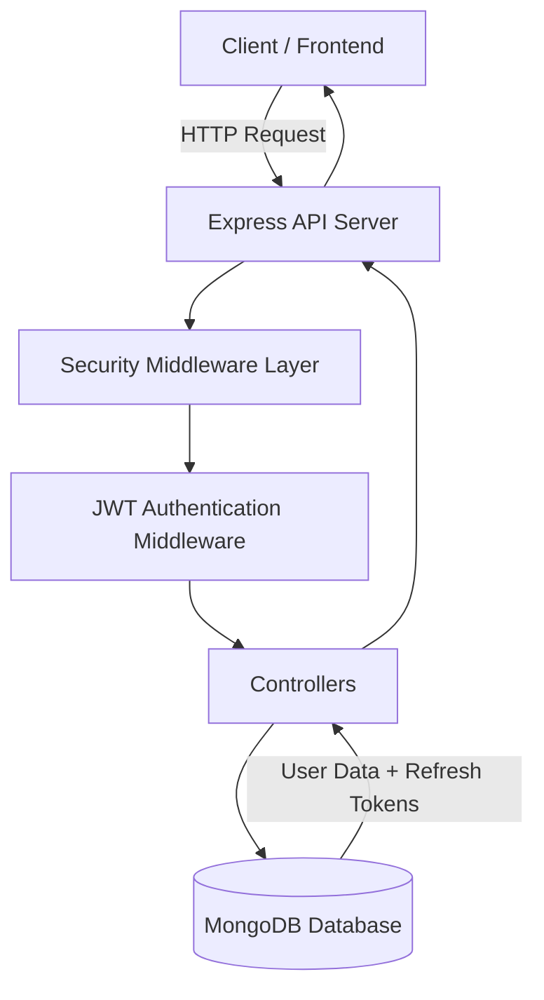
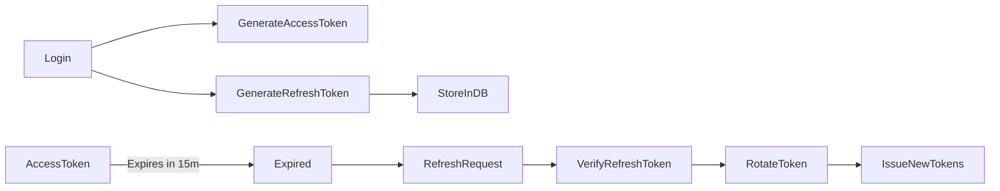
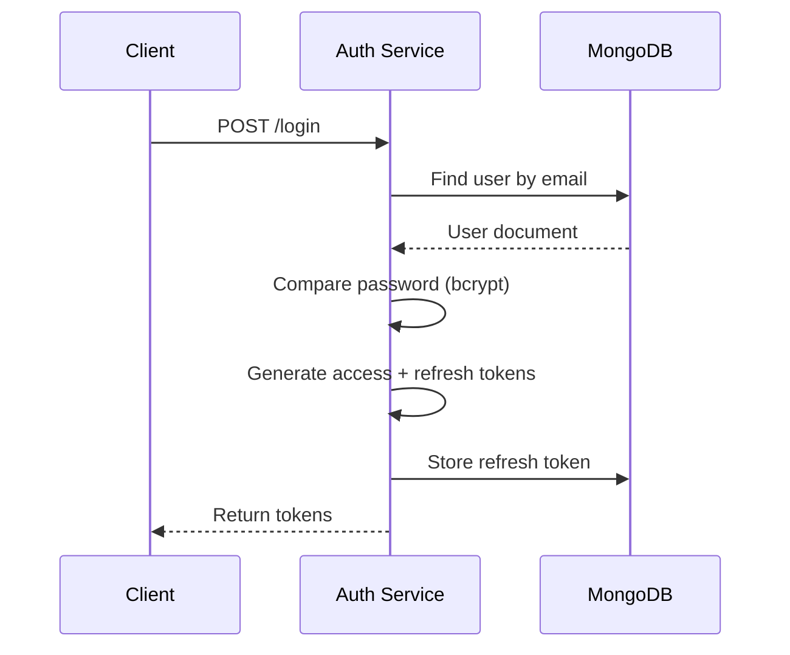

# 🔐 Auth Service (Enterprise-Grade Authentication System)

## 📌 Overview

This service implements a production-ready authentication system built with:

- Node.js
- Express
- MongoDB
- JWT (Access + Refresh Tokens)
- Role-Based Access Control (RBAC)
- Rate Limiting
- Structured Logging (Winston + Morgan)
- Zod Validation
- Docker Support

It follows enterprise-level security and backend architecture best practices.

---

---

# 🏗 System Architecture



# 🚀 Features Implemented

## 1️⃣ User Registration

- Email uniqueness enforced using MongoDB unique index
- Password hashing using bcrypt (pre-save hook)
- Zod validation for request payload
- Duplicate email handling (race-condition safe)
- Secure response (password never exposed)

---

## 2️⃣ Login Flow

- Password verification using bcrypt.compare()
- Access Token (15 min expiry)
- Refresh Token (7 days expiry)
- Token payload includes `userId` and `role`

---

## 3️⃣ JWT Authentication

- Access token verification middleware
- Protected routes
- Token extracted from `Authorization: Bearer <token>`

---

## 4️⃣ Refresh Token Strategy (Enterprise-Level)

- Refresh tokens stored in DB
- Multi-device session support
- Token rotation implemented
- Old refresh token invalidated during refresh
- Logout removes refresh token from DB

---

## 5️⃣ Role-Based Access Control (RBAC)

- Middleware-based authorization
- Supports roles:
  - `USER`
  - `ADMIN`
- Admin-only route example included

---

## 6️⃣ Security Enhancements

- Global rate limiting
- Password hashing with salt rounds
- Unique index to prevent race condition duplicates
- Centralized error handling
- Prevents user enumeration via consistent error responses

---

## 7️⃣ Validation Layer

- Zod schema validation
- Structured validation errors
- Controllers kept clean

---

## 8️⃣ Logging

- Winston for structured logging
- Morgan for HTTP request logging
- Logs stored in:
  - `logs/error.log`
  - `logs/combined.log`

---

## 9️⃣ Global Error Handling

- Centralized error middleware
- Handles:
  - Zod validation errors
  - Mongo duplicate key errors
  - JWT errors
  - Unhandled exceptions

---

# 🔁 Token Lifecycle



### 🔑 Login Flow

User logs in →
Generate Access Token →
Generate Refresh Token →
Store Refresh Token in DB →
Return tokens to client



### 🔄 Refresh Flow

Client sends Refresh Token →
Verify signature →
Check if token exists in DB →
Remove old token →
Generate new Access + Refresh tokens →
Store new refresh token

---

### 🚪 Logout Flow

Client sends Refresh Token →
Remove token from DB →
Session invalidated

---

# 📂 Project Structure
```bash
01-auth-service/
│
├── src/
│ ├── config/
│ ├── controllers/
│ ├── middleware/
│ ├── models/
│ ├── routes/
│ ├── utils/
│ └── validation/
│
├── logs/
├── server.js
└── README.md
```

# 🧪 API Endpoints

## 🔹 POST /api/auth/register

Registers a new user.

## 🔹 POST /api/auth/login

Returns access and refresh tokens.

## 🔹 POST /api/auth/refresh

Generates new access token with rotation.

## 🔹 POST /api/auth/logout

Invalidates refresh token.

## 🔹 GET /api/profile

Protected route (requires access token).

## 🔹 GET /api/admin

Admin-only route.

---

# ⚙️ Environment Variables

### Create a .env file:

```bash
PORT=4000
MONGO_URI=mongodb://127.0.0.1:27017/auth_service
JWT_ACCESS_SECRET=your_access_secret
JWT_REFRESH_SECRET=your_refresh_secret
```

---

# 🧠 Key Engineering Decisions

- **Unique index** used to prevent race-condition duplicates at the database level.
- **Refresh tokens stored in database** to enable secure logout and token rotation.
- **Validation layer separated from controllers** to keep business logic clean and maintainable.
- **Middleware-driven authentication & authorization** for scalable and reusable security handling.
- **Structured logging (Winston + Morgan)** implemented for production-grade debugging and monitoring.
- **Modular folder structure** designed for scalability and maintainability.

---

# 📈 Future Improvements

- Redis-based token blacklist for enhanced token invalidation.
- OAuth 2.0 integration (Google/GitHub login).
- Multi-factor authentication (MFA).
- Swagger/OpenAPI documentation for API contracts.
- Monitoring & APM integration (Datadog / New Relic).

---

# 👨‍💻 Author

Built as part of an enterprise MERN learning series focused on real-world backend architecture.
